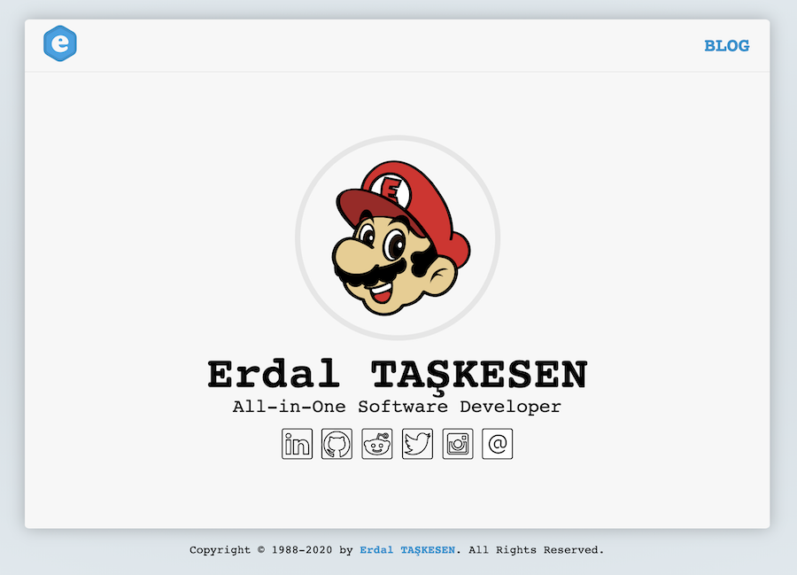

# erdaltaskesen.com


[](https://app.netlify.com/sites/erdaltaskesen/deploys)
[](LICENSE)

The source code of my personal website/blog.



## Requirements

- [Hugo](https://gohugo.io/)

## Features

- Hugo based static website
- Custom Theme
- Blog
- RSS
- Sitemap

## Getting Started

```sh
git clone https://github.com/erdaltsksn/erdaltaskesen-com.git
cd erdaltaskesen-com
hugo server
```

### Via Docker

```sh
git clone https://github.com/erdaltsksn/erdaltaskesen-com.git
cd erdaltaskesen-com
make hugo
```

You can visit the website at [http://localhost:1313/](http://localhost:1313/)

## Installation

Run the following command to generate static website. The static website output
will be inside `public` folder.

```sh
hugo
```

### Deployment and hosting with Netlify

1. Create a new site in Netlify and import your repository.
2. Set the build command to: `hugo`
3. Set the publish directory to: `public`
4. Make sure to set `Build Image` to `Ubuntu Xenial 16.04` or above.

That's it, now your site gets deployed automatically on `git push`.

## Updating / Upgrading

See [Go Hugo Docs](https://gohugo.io/getting-started/installing/#upgrade-hugo)
for upgrading Hugo.

## Usage

### Serving

Just copy the content of `public` folder to the root of your webserver.

### Deploying

- **Build command:** `hugo`
- **Publish directory:** `public`

### Creating new contents

You can use the following command to create a new content.

```sh
# To Create a new blog post
hugo new blog/2020-05-12-title-of-the-post.md

# Creating a new blog post via MAKE
make post title="this-is-awesome-with-makefile"
```

## Getting Help

### Help for Hugo

See official [Hugo Docs](https://gohugo.io/documentation/) to getting help about
**Hugo**.

### Help for Makefile

```sh
make help
```

## Contributing

If you want to contribute to this project and make it better, your help is very
welcome. See [CONTRIBUTING](.github/CONTRIBUTING.md) for more information.

## Security Policy

If you discover a security vulnerability within this project, please follow our
[Security Policy Guide](.github/SECURITY.md).

## Code of Conduct

This project adheres to the Contributor Covenant [Code of Conduct](.github/CODE_OF_CONDUCT.md).
By participating, you are expected to uphold this code.

## Disclaimer

In no event shall we be liable to you or any third parties for any special,
punitive, incidental, indirect or consequential damages of any kind, or any
damages whatsoever, including, without limitation, those resulting from loss of
use, data or profits, and on any theory of liability, arising out of or in
connection with the use of this software.
